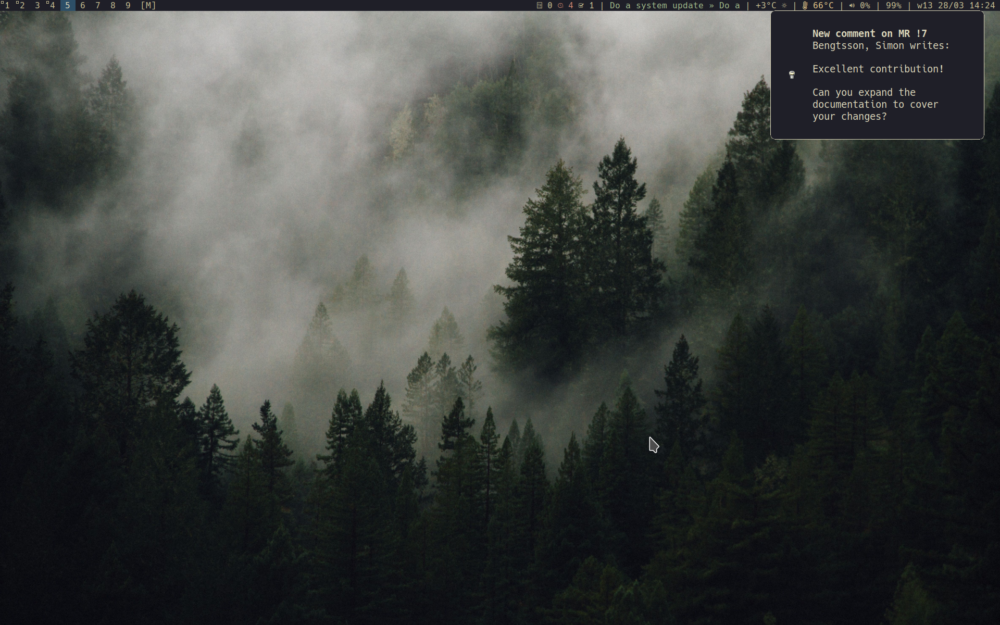

# Reviewcheck

Reviewcheck is a tool to stay up to date with your reviews on GitLab. You can
configure it to use any GitLab instance you have access to. The tool checks all
open merge requests in the repositories chosen by you, and lets you know if
there are open threads that need your attention.

Reviewcheck is in active development.

## Installation

Reviewcheck depends on Python >=3.8.1. There are multiple ways to install it.
The simplest is with `pipx`.

### With `pipx`

Reviewcheck can be installed with the following command:

```console
$ pipx install reviewcheck
```

### With Poetry

If you are a developer, the best way to test changes you make without having to
create a Python package and install it is to clone the repository and run
`poetry run reviewcheck` from within it. You will need to have poetry
installed. The process looks as follows:

```console
$ pipx install poetry
$ git clone https://github.com/volvo-cars/Reviewcheck
$ cd reviewcheck
$ poetry install
$ poetry run reviewcheck
```

### With Docker

There's also a Dockerfile available to use. Currently it does not get uploaded
anywhere, so you'll need to build it locally and then run it. Example commands:

```console
$ docker build -t reviewcheck .
$ docker run -tv ~/.config/reviewcheckrc:/root/.config/reviewcheckrc reviewcheck
```

## Getting Started

Reviewcheck has a terminal-based user interface. You run it on the command line
with `reviewcheck`. The first time you run it, you will be able to
interactively configure it to find your reviews.

After that, any time you run `reviewcheck`, you will be presented with a list
of threads from any MR where your response is needed. You can configure how
verbose the output is with options. See the `--help` option for more information
about that.

Whenever there is a new review comment that wasn't present the last time
Reviewcheck fetched comments, you will receive a desktop notification. An
example:



Notifications are sent using `notify-send` so the notification should look like
any other desktop notification on your system. They will likely differ in
visual appearance from the example image.

### Configuration

The first time you run Reviewcheck, the interactive configuration will start. If
you ever want to reconfigure it, just run `reviewcheck configure`. You can also
modify the configuration file directly. Unless you configured a separate
configurations directory, it should be in `~/.config/reviewcheckrc`.

You will be asked for an access token. It can be created in your GitLab
settings, under "User settings" > "Access Token". It should have at least the
`read_api` access.

You will also be asked for your "GitLab URL". For the main GitLab instance, it
would be `https://gitlab.com` but if you have your own instance, use that
instead. Do not add a slash at the end.

There is the possibility to add a Jira base URL. It is used if you have Jira
ticket referenced in your commits. An example would be
`https://jira.example.com`.

Finally, you should fill in the project IDs of projects where you want to track
merge requests. This can be a bit tricky to find and you might need to consult
the GitLab documentation. It may be under the title of your repository. It may
also be to the right of the title, under the three-dots menu.

After that, you're all set.

## FAQ

<dl>
  <dt>How do I configure Reviewcheck?</dt>
  <dd>The first time you run `reviewcheck`, the interactive configuration will
  start. You can rerun it with `reviewcheck configure`. If you know what you're
  doing, you may also edit the configuration file directly. You'll find the
  configuration file `reviewcheckrc` in your configuration files directory,
  usually `~/.config/`.</dd>

  <dt>Will you support other software hosting pages than GitLab?</dt>
  <dd>Yes! We hope to support Gerrit in the near future and Gitea and GitHub in the
  far future.</dd>

  <dt>What triggers the desktop notifications?</dt>
  <dd>When Reviewcheck is run and a new message is discovered in a thread that
  Reviewcheck judges you should respond to, you will get a desktop notification
  containing the new message. This may be useful when you're running in a loop
  with the `--refresh` option.</dd>

  <dt>Why are you asking for a JIRA URL?</dt>
  <dd>This is only relevant if your organization uses JIRA and tags merge requests
  with the JIRA ticket number. It will help Reviewcheck provide you with a link
  to the ticket connected to the merge request. Please report a bug if your
  organization uses JIRA but the current system doesn't work for you.</dd>

  <dt>How can I get regular updates without having to remember to run Reviewcheck?</dt>
  <dd>You may benefit from running Reviewcheck with the `--refresh` option. It will
  check for new review data at a regular interval of your choosing. For example.
  if you run `reviewcheck --refresh 10`, you will get a new report every 10
  minutes. You can even keep Reviewcheck running in the background this way,
  since you get desktop notifications any time there is a new message that needs
  your attention.</dd>
</dl>

## Support

For support or other queries, contact project owner [Simon
Bengtsson](mailto:simon.bengtsson.3@volvocars.com) or project maintainer [Pontus
Laos](mailto:pontus.laos@volvocars.com).

## Contributing

See the [contributing guide](CONTRIBUTING.md) for detailed instructions on how to get
started with this project.

## Code of Conduct

This project adheres to the [Code of Conduct](./.github/CODE_OF_CONDUCT.md). By
participating, you are expected to honor this code.

## License

This repository is licensed under [Apache License 2.0](LICENSE) © 2022 Volvo Cars.
